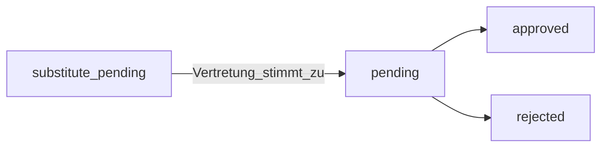

# ArbeitszeitCheck – Benutzerhandbuch

Dieses Handbuch erklärt die **Bedienung von ArbeitszeitCheck** in Nextcloud: welche Bereiche es gibt, wie sich Rollen unterscheiden und wie typische Abläufe (Zeiterfassung, Abwesenheiten, Freigaben, Compliance) funktionieren. Technische Details zur ArbZG-Umsetzung finden Sie in [Compliance-Implementation.de.md](Compliance-Implementation.de.md). Hinweise zum DSGVO-Betrieb in [GDPR-Compliance-Guide.en.md](GDPR-Compliance-Guide.en.md) (englisch; organisationsintern ggf. deutschsprachige Fassung nutzen).

---

## Rechtlicher Hinweis

ArbeitszeitCheck unterstützt technische Maßnahmen nach dem deutschen **Arbeitszeitgesetz (ArbZG)** und Aufzeichnungspflichten. Die App **ersetzt keine Rechtsberatung**. Arbeitgeber und Verantwortliche bleiben für Richtlinien, Konfiguration und die Verwendung der Daten verantwortlich. Im Zweifel: Rechtsabteilung, Betriebsrat oder Fachanwalt einbinden.

---

## Wie Sie dieses Handbuch nutzen

- **Mitarbeitende** lesen ab [Was ist ArbeitszeitCheck?](#was-ist-arbeitszeitcheck), können Admin-Kapitel überspringen und nutzen bei Problemen [Fehlerbehebung](#fehlerbehebung-und-häufige-fragen).
- **Führungskräfte** sollten [Teams, Führungskräfte und Freigaben](#teams-führungskräfte-und-freigaben), [Manager-Dashboard](#manager-dashboard) und [Berichte](#berichte) lesen.
- **Nextcloud-Administratoren** lesen [Ersteinrichtung](#ersteinrichtung-und-erster-einsatz), [Administration](#administration-nextcloud-administratoren), [Globale Einstellungen](#globale-einstellungen-referenz-für-administratoren) und die Tabelle [Zahlen und Grenzen](#zahlen-und-grenzen-kurzübersicht).

Zuerst kommen **einfache Erklärungen**, dort wo nötig folgen **genaue Begriffe** (Status, Konfigurationsschlüssel), damit nichts schiefgeht.

---

## Inhaltsverzeichnis

1. [Was ist ArbeitszeitCheck?](#was-ist-arbeitszeitcheck)
2. [Ersteinrichtung und erster Einsatz](#ersteinrichtung-und-erster-einsatz)
3. [Teams, Führungskräfte und Freigaben](#teams-führungskräfte-und-freigaben)
4. [Rollen und Sichtbarkeit](#rollen-und-sichtbarkeit)
5. [App öffnen und Navigation](#app-öffnen-und-navigation)
6. [Dashboard](#dashboard)
7. [Zeiteinträge](#zeiteinträge)
8. [Abwesenheiten und Urlaub](#abwesenheiten-und-urlaub)
9. [Berichte](#berichte)
10. [Arbeitszeit-Compliance](#arbeitszeit-compliance)
11. [Kalender und Zeitachse](#kalender-und-zeitachse)
12. [Einstellungen](#einstellungen)
13. [Manager-Dashboard](#manager-dashboard)
14. [Vertretungsanfragen](#vertretungsanfragen)
15. [Administration (Nextcloud-Administratoren)](#administration-nextcloud-administratoren)
16. [Globale Einstellungen (Referenz für Administratoren)](#globale-einstellungen-referenz-für-administratoren)
17. [Exporte, DATEV und Datenexport](#exporte-datev-und-datenexport)
18. [Benachrichtigungen und Hintergrundjobs](#benachrichtigungen-und-hintergrundjobs)
19. [Optionale ProjectCheck-Anbindung](#optionale-projectcheck-anbindung)
20. [Fehlerbehebung und häufige Fragen](#fehlerbehebung-und-häufige-fragen)
21. [Zahlen und Grenzen (Kurzübersicht)](#zahlen-und-grenzen-kurzübersicht)
22. [Glossar](#glossar)

---

## Was ist ArbeitszeitCheck?

ArbeitszeitCheck ist eine **selbst gehostete** Zeiterfassungs-App in Ihrer Nextcloud. Sie orientiert sich an **deutschem Arbeitsrecht (ArbZG)**: Höchstarbeitszeiten, Pausen, Ruhezeiten, Dokumentation von Nacht-/Sonntags-/Feiertagsarbeit. Daten verlassen Ihren Server nicht über die App hinaus.

Typische Funktionen:

- **Kommen/Gehen** und **Pausen** erfassen und den aktuellen Status sehen.
- **Zeiteinträge** anlegen und bearbeiten (soweit erlaubt).
- **Abwesenheiten** beantragen (Urlaub, Krankheit u. a.) mit Freigabeprozessen.
- **Compliance** und Verstöße zu den erfassten Zeiten einsehen.
- **Kalender** und **Zeitachse** zur Übersicht.
- **Führungskräfte** genehmigen Abwesenheiten und **Zeiteintrag-Korrekturen** für ihr Team; **Administratoren** konfigurieren Modelle, Feiertage, Teams und globale Regeln.

---

## Große Konzepte in einfachen Worten

| Begriff | Einfache Erklärung |
|---------|-------------------|
| **Sie** | Die angemeldete Person in Nextcloud. Alle Daten werden **pro Benutzerkonto** geführt. |
| **Zeiteintrag** | Ein zusammenhängender Arbeitsblock mit **Beginn** und **Ende** (und ggf. **Pausen**). Das ist der kleinste Baustein für alle Auswertungen. |
| **Ein-/Ausstempeln** | Schaltflächen, die eine laufende Schicht **starten** oder **beenden**, ohne Uhrzeiten manuell einzutippen. |
| **Pause** | Zeit **ohne Arbeit** innerhalb einer Schicht. **Pause starten** / **Pause beenden** sind eigene Schritte. |
| **Arbeitszeitmodell** | Ein **Regelpaket** (Sollstunden, Pausen, Grenzen), das die **Administration** Ihnen zuweist. |
| **Abwesenheit** | Ein Antrag für einen oder mehrere **Tage** frei (Urlaub, Krankheit, …). Kann **Freigaben** brauchen und **Urlaubstage** verbrauchen. |
| **Kollege / Kollegin** | Jemand, den die App zu Ihrem **Team** rechnet – siehe [Teams](#teams-führungskräfte-und-freigaben). |
| **Compliance** | Automatischer **Vergleich** Ihrer Zeiten mit den eingestellten Regeln. Ein **Verstoß** ist ein **Hinweis der Software**, kein Gerichtsurteil. |
| **Korrektur** | Ein **formaler Änderungsantrag** für einen alten Zeiteintrag: Sie schlagen Zeiten und eine **Begründung** vor; eine **Führungskraft** (oder in Sonderfällen das System) muss zustimmen. |

---

## Ersteinrichtung und erster Einsatz

### Server und App (Administratoren)

1. **Installation und Aktivierung** der App auf der Nextcloud-Instanz (`occ app:enable arbeitszeitcheck` oder über „Apps“). Bei Upgrades laufen Datenbank-Migrationen; Upgrades sollten vollständig durchlaufen.
2. **Teammodell festlegen**, bevor viele Nutzer eingebunden werden (siehe [Teams, Führungskräfte und Freigaben](#teams-führungskräfte-und-freigaben)): entweder **gemeinsame Nextcloud-Gruppen** (Standard) oder **ArbeitszeitCheck-App-Teams** mit expliziten Mitgliedern und Führungskräften.
3. **Globale Einstellungen** öffnen: **Administration** in ArbeitszeitCheck oder **Nextcloud-Verwaltung → ArbeitszeitCheck** – Bundesland für Feiertage, Compliance-Schalter, Resturlaub-Regeln, Benachrichtigungen ([Referenz](#globale-einstellungen-referenz-für-administratoren)).
4. **Arbeitszeitmodelle** anlegen und unter **Administration → Mitarbeitende** zuweisen (Arbeitszeit, Urlaubstage, Gültigkeit, Anfangsbestände je nach Prozess).
5. **Feiertage** pflegen: gesetzliche Feiertage hängen vom konfigurierten **Bundesland** ab; betriebliche Tage unter **Feiertage und Kalender**.
6. Optional: Urlaubssalden per `occ arbeitszeitcheck:import-vacation-balance` importieren (siehe Server-/Entwicklerdokumentation).

Solange Gruppen/Teams und Modelle fehlen, sehen Mitarbeitende u. U. **leere Kollegenlisten** (keine Vertretung), **keine Freigabe** oder im Grenzfall **automatische Genehmigungen** – siehe nächster Abschnitt.

### Erster Login (Mitarbeitende)

- Ohne bisherige Zeiteinträge zeigt das **Dashboard** eine **Willkommens**-Karte mit Kurzschritten: Ein-/Ausstempeln, Pausen, manuelle Einträge, **Abwesenheiten**.
- Pro Nutzer kann ein Flag **Onboarding abgeschlossen** gespeichert werden (API `/api/settings/onboarding-completed`); ob eine geführte Tour angezeigt wird, hängt von der Oberflächenversion ab.
- **Persönliche** Einstellungen: **Meine Einstellungen** in der App und/oder **Nextcloud → Persönlich → ArbeitszeitCheck** (Urlaubstage, Normalarbeitszeit, Benachrichtigungen – Ihre Organisation sollte eine verbindliche Einstiegsvariante nennen).

---

## Teams, Führungskräfte und Freigaben

Die App ermittelt **Teammitglieder**, **Kolleginnen/Kollegen** (z. B. für Vertretungen) und **Wer darf freigeben**, über einen zentralen Schalter:

| Modus | Konfiguration `use_app_teams` | Wo umschalten |
|-------|-------------------------------|---------------|
| **Nextcloud-Gruppen (Legacy)** | `0` (Standard) | **Administration → Teams und Standorte**: Schalter **Aus** („ArbeitszeitCheck-Teams für Freigaben nutzen“) |
| **App-Teams** | `1` | dieselbe Seite: Schalter **An** |

### Modus A: Nextcloud-Gruppen (Standard, `use_app_teams = 0`)

- **Teammitglieder** eines Benutzers sind **alle anderen Benutzer, die mindestens eine Gruppe mit diesem Benutzer teilen**.
- **Kollegen** (Vertretungsliste, „hat jemanden im Team“) sind dieselbe Menge: andere Mitglieder gemeinsamer Gruppen.
- Es gibt **keine benannten Führungskräfte in der Datenbank**. Freigaben prüfen „darf dieser Benutzer jenen verwalten?“ – in diesem Modus über **gemeinsame Gruppenzugehörigkeit** (zuzüglich Nextcloud-Admins). **Große gemeinsame Gruppen** können dazu führen, dass sich viele gegenseitig zuordnen – **Gruppenstruktur bewusst planen** oder auf App-Teams wechseln.
- **Manager-Menü / Berichte**: erscheinen, wenn es mindestens ein **anderes Teammitglied** gibt **oder** der Nutzer Admin ist – ohne geteilte Gruppe mit anderem Nutzer kein Manager-UI für Nicht-Admins.

### Modus B: App-Teams (`use_app_teams = 1`)

- Unter **Administration → Teams und Standorte** wird eine **Hierarchie** („Einheit hinzufügen“, Baumstruktur) gepflegt.
- Pro Einheit gibt es Register **Mitglieder** und **Führungskräfte**.
- **Führungskräfte** sehen Anträge von Mitgliedern der von ihnen geführten Teams **einschließlich untergeordneter Einheiten** im Baum.
- **Kollegen** für Vertretungen: Nutzer in Teams, in denen Sie **Mitglied oder Führungskraft** sind (reine Führungskräfte sehen dennoch Teammitglieder als Kollegen).
- **Explizite Vorgesetzte** pro Mitarbeitendem: die App kann Führungskräfte den Teams der Person zuordnen (`getManagerIdsForEmployee`). Einige Funktionen (z. B. **E-Mail an Führungskräfte nach Vertretungsfreigabe**) setzen laut UI **App-Teams** voraus.

### Automatische Genehmigung, wenn niemand freigeben kann

| Situation | Abwesenheit (nur Status `pending`, ohne Vertretungspfad) | Zeiteintrag-Korrektur |
|-----------|-----------------------------------------------------------|------------------------|
| Logik | Auto-Genehmigung, wenn die interne Prüfung **keinen „Manager-Kontext“** findet: Zuerst: bei App-Teams **keine zugewiesenen Führungskräfte** für die Teams der Person; sonst Fallback: **keine Kollegen** (`getColleagueIds` leer). | Auto-Genehmigung, wenn **`getColleagueIds` leer** ist – **ohne** die gleiche Managerliste wie bei Abwesenheiten. |
| Praxis | Stark isolierte Nutzer (allein in Gruppen / ohne Kollegen) erhalten ggf. **sofort genehmigte** Anträge. | Analog für Korrekturen: **ohne Kollegen** im konfigurierten Modell. |

**Konsequenz für den Betrieb:** Für echte Vier-Augen-Freigaben müssen **Teams/Gruppen und ggf. Führungskräfte** so gepflegt sein, dass keine unbeabsichtigte Auto-Genehmigung entsteht.

### Leere Kollegenliste?

- Kollegen werden aus dem aktiven Modus berechnet. Liste leer → keine Vertretung wählbar → **Gruppenmitgliedschaft** oder **App-Team-Mitgliedschaft** prüfen.

---

## Rollen und Sichtbarkeit

| Rolle | Bedeutung in der App |
|-------|----------------------|
| **Mitarbeitende** | Jeder angemeldete Benutzer. Erfasst eigene Zeiten und Abwesenheiten; sieht eigene Compliance; Exporte **nur für eigene Daten**. |
| **Führungskraft / Manager** | Benutzer mit **mindestens einem Teammitglied** im Teammodell der App (Nextcloud-Gruppen und/oder App-Teams, je nach Konfiguration). Kann das **Manager**-Dashboard öffnen und Freigaben für diese Personen bearbeiten. |
| **Nextcloud-Administrator** | Mitglied der Nextcloud-Admin-Gruppe. Sieht den Menüpunkt **Administration** (globale Einstellungen, Nutzer, Arbeitszeitmodelle, Feiertage, Teams, Protokoll). Admins erhalten dort, wo die App es vorsieht, erweiterte Zugriffe (z. B. Berichte). |
| **Vertretung** | Bei Abwesenheitsanträgen ausgewählte Kollegin oder Kollege. Liegt ein Antrag auf **Vertretungsfreigabe** vor, kann die Vertretung auf der Seite **Vertretungsanfragen** zustimmen oder ablehnen (Menüpunkt erscheint, wenn ausstehende Anfragen existieren). |

**Wichtig:** Der Eintrag **Berichte** in der Seitenleiste erscheint nur für Personen mit **Berichtszugriff auf Führungsebene** (wer Teammitglieder hat **oder** Administrator ist). Reine Mitarbeitende ohne Teamverantwortung sehen **keine** Berichte; ein direkter Aufruf der Berichte-URL wird ins Dashboard umgeleitet.

---

## App öffnen und Navigation

1. In Nextcloud anmelden.
2. Über das App-Menü **ArbeitszeitCheck** wählen (oder den Namen, den Ihre Organisation verwendet).

Die linke Navigation enthält typischerweise:

| Eintrag | Zweck |
|---------|--------|
| **Dashboard** | Startseite: Status, Stempeluhr, heutige Stunden, letzte Einträge. |
| **Zeiteinträge** | Liste, Neuen Eintrag, Bearbeiten, Korrekturen. |
| **Abwesenheiten** | Anträge und Verwaltung von Abwesenheiten. |
| **Berichte** | Nur für Führungskräfte und Administratoren: Team-/Organisationsauswertungen. |
| **Arbeitszeit-Compliance** | Übersicht und Verstöße. |
| **Kalender** | Kalenderansicht von Arbeit und Abwesenheiten. |
| **Zeitachse** | Chronologische Darstellung der Zeiten. |
| **Meine Einstellungen** | Persönliche Optionen und DSGVO-Datenexport. |
| **Administration** | Nur Nextcloud-Admins: Unterseiten Übersicht, Mitarbeitende, Arbeitszeitmodelle, Feiertage, Teams, Protokoll, globale Einstellungen. |
| **Manager** | Bei Teamverantwortung oder Admin: Freigaben und Teamüberblick. |
| **Vertretungsanfragen** | Bei ausstehenden Vertretungsfreigaben: Annehmen oder Ablehnen. |

---

## Dashboard

Das **Dashboard** ist die **Startseite** der App – Ihr **Bedienfeld für den heutigen Tag**.

### Was Sie sehen (einfach erklärt)

- **Status**: ob Sie **gerade arbeiten** (eingestempelt), **Pause** haben oder **nicht arbeiten** (ausgestempelt).
- **Timer**: oft die **Dauer** der aktuellen Schicht oder Pause.
- **Schaltflächen**: nur Aktionen, die **jetzt** Sinn ergeben (z. B. keine „Pause beenden“, wenn keine Pause läuft).
- **Heute**: Kurzinfo zu **Stunden heute** (Bezeichnung je nach Sprache).
- **Letzte Einträge**: die **neuesten Zeiteinträge**, um Fehler schnell zu sehen.
- **Urlaub / Kennzahlen** (falls angezeigt): z. B. **Resturlaub** – Ihre Administration pflegt die Grundlagen.

### Typischer Ablauf (Schritt für Schritt)

1. **Arbeitsbeginn** → **Einstempeln**. Status: eingestempelt.
2. **Pause nötig** → **Pause beginnen**, zurückkommen → **Pause beenden**.
3. **Arbeitsende** → **Ausstempeln**. Der Eintrag landet unter **Zeiteinträge**.
4. Vergessen? Eintrag unter **Zeiteinträge** anlegen oder innerhalb von **14 Tagen** korrigieren; älter → **Korrektur**.

### Erster Besuch

Ohne bisherige Zeiteinträge kann eine **Willkommens**-Box erscheinen. Ihre Daten finden Sie trotzdem unter **Zeiteinträge**.

---

## Zeiteinträge

Unter **Zeiteinträge** liegt die **vollständige Liste** Ihrer Arbeitsperioden.

### Liste und Details öffnen

- Tabellarische **Übersicht**, oft mit **Datum**, **von–bis**, **Dauer** – je nach Oberfläche **Filter** (Zeitraum, Status).
- Klick öffnet die **Detailansicht**: Start, Ende, Pausen, ggf. Hinweise zur **Compliance**.
- Von hier aus: **bearbeiten** (wenn erlaubt), **löschen** (wenn erlaubt), **Korrektur beantragen**.

### Neuen Eintrag anlegen (manuell)

1. **Zeiteinträge** → **Neu** / **Anlegen** (Bezeichnung je nach Sprache).
2. **Start** und **Ende** eintragen, ggf. Pausen.
3. **Speichern**. Die App prüft **Überschneidungen** und **Regeln**.

### Regeln beim Bearbeiten

- **Manuelle** Zeiträume nur, wenn Ihre Organisation das erlaubt.
- **14-Tage-Fenster**: direktes Bearbeiten meist nur für Einträge der **letzten 14 Tage** (`EDIT_WINDOW_DAYS`). Älter → **Korrekturanfrage**.
- **Keine Überschneidung**: zwei Einträge dürfen nicht dieselbe Minute **doppelt** abdecken.
- **Löschen**: kann einen Hinweis zu **Auswirkungen** zeigen (Überstunden, Compliance) – vorher lesen.

### Stempeluhr vs. manuelle Einträge

- **Stempeluhr** (Dashboard): die App führt **einen laufenden Eintrag** während der Schicht; Sie tippen Start/Ende der **aktuellen** Schicht nicht von Hand.
- **Manuell**: Sie tragen den **ganzen** Zeitraum ein – z. B. wenn Sie **vergessen** haben zu stempeln.

### Überstunden / Salden (falls angezeigt)

Hängt vom **Arbeitszeitmodell** und den erfassten Zeiten ab. Bei Abweichungen zuerst **Einträge** prüfen, dann die **Administration** fragen.

### Korrekturworkflow (nach Ablauf des Bearbeitungsfensters)

Wenn Sie einen Eintrag nicht mehr direkt bearbeiten dürfen (z. B. zu alt), können Sie eine **Korrektur beantragen**:

1. Sie senden die Korrektur mit **Begründung** (Pflicht).
2. Der Eintrag erhält den Status **`pending_approval`**, bis jemand mit Freigaberecht **genehmigt** oder **ablehnt** (Führungskraft bei App-Teams, geeigneter Freigeber bei Gruppenmodus, Nextcloud-Admin).
3. Gibt es im konfigurierten Team-/Gruppenmodell **keine Kollegen** (`getColleagueIds` leer), kann die Korrektur **sofort automatisch genehmigt** werden ([Details](#teams-führungskräfte-und-freigaben)).
4. Bei **Genehmigung** werden die vorgeschlagenen Änderungen übernommen; bei **Ablehnung** bleibt der ursprüngliche Eintrag bestehen.

Führungskräfte bearbeiten ausstehende Korrekturen im **Manager**-Dashboard.

### Optional: ProjectCheck

Wenn die App **ProjectCheck** installiert und aktiv ist, können Formulare ein **Projekt aus ProjectCheck** verknüpfen – je nach Instanz optional.

---

## Abwesenheiten und Urlaub

### Abwesenheitstypen

Die App unterstützt u. a. folgende Typen (interne Kennungen in Klammern):

- Urlaub (`vacation`)
- Krankheit (`sick_leave`)
- Persönliche Abwesenheit (`personal_leave`)
- Elternzeit (`parental_leave`)
- Sonderurlaub (`special_leave`)
- Unbezahlter Urlaub (`unpaid_leave`)
- Homeoffice (`home_office`)
- Dienstreise (`business_trip`)

Die sichtbaren Bezeichnungen hängen von Sprache und UI ab.

### Abwesenheit beantragen (Schritt für Schritt)

1. **Abwesenheiten** in der Seitenleiste öffnen.
2. **Neu** / **Antrag erstellen** wählen (Bezeichnung je nach Sprache).
3. **Typ** wählen (Urlaub, Krankheit, …).
4. **Start**- und **Enddatum** setzen, ggf. **Grund** oder **Vertretung** eintragen.
5. **Absenden**. Die App berechnet **Arbeitstage** und kann bei bestimmten Typen eine **Pflicht-Vertretung** verlangen.
6. **Status** in der Liste verfolgen: z. B. `substitute_pending` → `pending` → `approved` oder `rejected`, oder kürzer ohne Vertretung.

### Urlaubssaldo

Anspruch, **Resturlaub** aus dem Vorjahr und Ablaufdaten werden von der **Administration** gepflegt (optional Import per Server-Kommando). Dashboard und Abwesenheiten können **verbleibende** Tage und **Übertrag** anzeigen – abhängig von der Konfiguration.

### Pflicht-Vertretung

Für bestimmte Abwesenheitstypen kann Ihr Administrator eine **Vertretung** vorschreiben. Sie wählen eine Kollegin oder einen Kollegen aus der **Kollegenliste** (gleiches Team). Sie können sich **nicht** selbst als Vertretung eintragen.

### Automatische Genehmigung einfacher Abwesenheitsanträge

Liegt ein Antrag mit Status **`pending`** vor (ohne Vertretungsschritt) und hat die Person **keinen Freigabe-Kontext** (keine zugewiesenen App-Team-Führungskräfte **und** keine Kollegen im Teammodell), wird die Abwesenheit **automatisch genehmigt**, damit sie nicht offen bleibt. Organisationen sollten das **nicht** bewusst nutzen, sondern Teams/Gruppen korrekt pflegen.

### Krankmeldung: Datum in der Vergangenheit

Beginn von Krankmeldungen dürfen nur **begrenzt weit in der Vergangenheit** liegen (aktuell **`SICK_LEAVE_MAX_PAST_DAYS` = 7** in `Constants.php`). Zu weit zurückliegende Daten können abgelehnt werden.

### Status und Ablauf

Abwesenheiten haben u. a. folgende Status:

| Status | Kurzbeschreibung |
|--------|------------------|
| `pending` | Wartet auf **Führungskraft** (ohne Vertretungsschritt oder nach Vertretungsfreigabe). |
| `substitute_pending` | Wartet auf die **benannte Vertretung**. |
| `substitute_declined` | Vertretung hat abgelehnt; Antrag kann angepasst (z. B. andere Vertretung) und erneut eingereicht werden. |
| `approved` | Genehmigt. |
| `rejected` | Von der Führungskraft abgelehnt. |
| `cancelled` | Storniert (Datensatz bleibt nachvollziehbar). |

Typischer Ablauf **mit** Vertretung:

**Ohne** Vertretung beginnt der Antrag oft direkt mit `pending` und geht zur Freigabe durch die Führungskraft.

### Stornieren und verkürzen

Je nach Status können Sie Abwesenheiten **stornieren** oder genehmigte Zeiträume **verkürzen** (die App prüft die erlaubten Übergänge).

### Kollegen und Teams

Die Vertretungsauswahl listet **Kolleginnen und Kollegen** aus Ihrem Team (Nextcloud-Gruppe oder App-Team). Ist die Liste leer, wenden Sie sich an Ihre Administration.

---

## Berichte

Die Seite **Berichte** gibt es nur für **Führungskräfte** und **Administratoren** ([Rollen](#rollen-und-sichtbarkeit)). **Normale** Mitarbeitende ohne Teamverantwortung sehen den Menüpunkt **nicht**; ein direkter URL-Aufruf leitet ins Dashboard um.

### Wozu Berichte dienen

Berichte sind **nur lesende** Auswertungen aus **Zeiteinträgen** und **Abwesenheiten**. Sie helfen Führung und HR, **Summen**, **Trends** und **Teamvergleiche** zu sehen – **ohne** die Rohdaten von dieser Seite zu ändern.

### Berichtstypen (überblick)

| Typ | Zweck in einfachen Worten |
|-----|---------------------------|
| **Tagesbericht** | Ein **Tag** im Detail – für Sie oder eine erlaubte Person. |
| **Wochenbericht** | **Woche** zusammengefasst – z. B. für Teamgespräche. |
| **Monatsbericht** | **Monat** – oft für Lohnvorbereitung oder Reviews. |
| **Überstunden** | Fokus auf **Mehrarbeit** gegenüber dem Modell – Definition über Konfiguration. |
| **Abwesenheiten** | **Urlaub & Co.** über einen Zeitraum. |
| **Team** | Mehrere Personen, die Sie führen dürfen – je nach Berechtigung. |

**Führungskräfte** wählen **sich** und **Teammitglieder**. **Administratoren** können je nach Oberfläche **ganzheitliche** Auswertungen (z. B. „alle Nutzer“) haben. **Fremde** Daten sind nie sichtbar.

---

## Arbeitszeit-Compliance

**Compliance** heißt: Die App **vergleicht** Ihre erfassten Zeiten mit den **eingestellten Regeln** (Pausen, Ruhezeiten, Höchstarbeitszeit …). Das ist **kein** Ersatz für eine Rechtsberatung.

### Drei Bereiche in der App

| Ansicht | Pfad (unter `/apps/arbeitszeitcheck`) | Zweck |
|---------|----------------------------------------|--------|
| **Übersicht** | `/compliance` | Zusammenfassung, Score – **eigene** oder **Team**-Themen je nach Rolle. |
| **Verstöße** | `/compliance/violations` | **Liste** mit Filtern; Zeile öffnen für Details. |
| **Compliance-Berichte** | `/compliance/reports` | **Berichtsartige** Übersicht, soweit Ihre Rolle reicht. |

### Verstöße „erledigen“

**Erledigt** markieren bedeutet meist: im **Prozess** geklärt (z. B. dokumentiert). Es **ändert nicht automatisch** Ihre Zeiteinträge – dafür **bearbeiten** oder **Korrektur** nutzen.

### Wer was sieht

- **Mitarbeitende**: nur **eigene** Verstöße.
- **Führungskräfte**: Team, soweit erlaubt.
- **Administratoren**: breitester Zugriff.

Technik: [Compliance-Implementation.de.md](Compliance-Implementation.de.md).

---

## Kalender und Zeitachse

Diese Ansichten dienen dem **Überblick**; **Korrekturen** machen Sie unter **Zeiteinträge** oder per **Stempeluhr**.

### Kalender (`/calendar`)

- **Monat/Woche** mit Arbeit und Abwesenheiten.
- Gut zum Erkennen von **Lücken**, **Überschneidungen** mit Urlaub oder **ungewöhnlichen** Zeiten.

### Zeitachse (`/timeline`)

- **Chronologische** Liste – „Was war **in welcher Reihenfolge**?“

---

## Einstellungen

Es kann **zwei Stellen** mit ähnlichen Schaltern geben: **in der App** und unter **Nextcloud Persönlich**. Nutzen Sie **eine** verbindliche Vorgabe Ihrer Organisation, damit sich Einstellungen nicht widersprechen.

### In-App (`/settings`)

Typische Gruppen:

- **Arbeitszeitvorgaben**, z. B. **automatische Pausenberechnung**.
- **Benachrichtigungen**: z. B. **Ausstempeln erinnern**, **Pausen erinnern** (zusammen mit Nextcloud-Mitteilungen).
- **Compliance-Infos**: kurze **ArbZG**-Hinweise.
- **Arbeitszeitmodell**: oft nur **Hinweis**, dass die **Administration** zuweist.
- **Datenexport**: **Meine Daten exportieren** → **JSON** (DSGVO-**Datenportabilität**).

### Nextcloud Persönlich

Oft: **Urlaubstage pro Jahr**, **Normalarbeitszeit**, **Benachrichtigungen**. Wenn etwas **ausgegraut** ist, zentralisiert die Administration die Werte.

---

## Manager-Dashboard

Menü **Manager** sehen Sie, wenn Sie **Teammitglieder** in der App haben oder **Administrator** sind.

### Ablauf (Checkliste)

1. **Abwesenheiten**: Antrag öffnen → **Genehmigen** oder **Ablehnen** (Kommentar je nach UI).
2. **Zeiteintrag-Korrekturen**: **Begründung** und **Vorschlag** lesen → **Genehmigen** (übernimmt neue Zeiten) oder **Ablehnen** (alter Stand bleibt).
3. **Team**: Stunden, Compliance, Abwesenheitskalender – je nach Version.

**Eigene** Abwesenheiten lösen Sie **nicht** selbst als Chef im Manager-Freigabe-Dialog; das regelt Ihr HR-Prozess.

---

## Vertretungsanfragen

Wenn Sie als **Vertretung** ausgewählt wurden und der Antrag `substitute_pending` ist, erscheint **Vertretungsanfragen** in der Seitenleiste (sobald mindestens eine offene Anfrage existiert).

- **Zustimmen**: Die Vertretung ist geklärt; der Antrag geht in die **Freigabe durch die Führungskraft** (`pending`), sofern kein abweichender Prozess konfiguriert ist.
- **Ablehnen**: Status `substitute_declined`; der Antragsteller kann z. B. eine andere Vertretung wählen.

E-Mail-Benachrichtigungen können durch die Administration aktiviert sein.

---

## Administration (Nextcloud-Administratoren)

Den Bereich **Administration** sehen nur **Nextcloud-Administratoren**. Dieselben **globalen Einstellungen** finden sich auch unter **Nextcloud-Verwaltung → Verwaltung → ArbeitszeitCheck** (eine konsistente Konfigurationsoberfläche).

| Bereich | Zweck |
|---------|--------|
| **Übersicht** | Kennzahlen und Einstiege in die App. |
| **Mitarbeitende** | Nutzer suchen, **Arbeitszeitmodelle** zuweisen, Urlaubstage, Gültigkeitszeiträume, Anfangsbestände (Resturlaub) je Kalenderjahr pflegen. |
| **Arbeitszeitmodelle** | Modelle (Sollstunden, Regeln) anlegen und bearbeiten, später Nutzern zuweisen. |
| **Feiertage und Kalender** | Gesetzliche und betriebliche Feiertage, Kalenderfunktionen. |
| **Teams und Standorte** | Schalter **ArbeitszeitCheck-Teams für Freigaben** und bei aktivem Modus die **Struktur**, **Mitglieder** und **Führungskräfte**. |
| **Protokoll** | Aktivitäts- und Änderungsprotokolle zur Auditunterstützung. |
| **Globale Einstellungen** | Sämtliche **instanzweiten** Schalter und Zahlenwerte (siehe nächster Abschnitt). |

**Urlaubssalden-Import** z. B. über `occ arbeitszeitcheck:import-vacation-balance` (siehe Dokumentation).

### Wozu jede Admin-Seite dient (kurz)

| Seite | Nutzen Sie sie, um … |
|-------|----------------------|
| **Übersicht** | **Kennzahlen** zu sehen und in andere Bereiche zu springen. |
| **Mitarbeitende** | **Alle Nutzer** zu finden, **Arbeitszeitmodelle** zuzuweisen, **Urlaubstage**, **Gültigkeit**, **Anfangsbestände** je Jahr zu pflegen. |
| **Arbeitszeitmodelle** | **Vorlagen** (Sollzeiten, Regeln) anzulegen und später zuzuweisen. |
| **Feiertage und Kalender** | **Gesetzliche** und **betriebliche** Feiertage zu pflegen. |
| **Teams und Standorte** | **App-Teams** ein- oder auszuschalten und **Baum**, **Mitglieder**, **Führungskräfte** zu verwalten. |
| **Protokoll** | **Änderungen** für Prüfungen nachzuvollziehen. |
| **Globale Einstellungen** | die **gesamte Instanz** (Compliance, E-Mail, Exporte, Verfall, Aufbewahrung) einzustellen. |

---

## Globale Einstellungen (Referenz für Administratoren)

Die folgenden Punkte gelten **instanzweit** (sofern nicht anders beschrieben). Die Bezeichnungen entsprechen der Formularoberfläche; Klammern: interne Konfigurationsschlüssel.

### Compliance und Arbeitszeitregeln

- **Arbeitszeitregeln automatisch prüfen** (`auto_compliance_check`)
- **Echtzeit-Compliance bei Erfassung** (`realtime_compliance_check`)
- **Strenger Modus** (`compliance_strict_mode`): bei Aktivierung können Verstöße das **Speichern blockieren**; sonst nur Hinweis
- **Benachrichtigungen bei Regelverstößen** (`enable_violation_notifications`)

### Exporte und Berichte

- **Mitternachts-Trennung in CSV/JSON** (`export_midnight_split_enabled`): nur Darstellung im Export; **DATEV** bleibt ungeteilt

### Abwesenheiten, E-Mail, Kalender

- **Resturlaub: Verfall** (Monat/Tag, `vacation_carryover_expiry_*`): letzter Tag für Nutzung des Vorjahres-Restes; danach nur noch Anspruch aus dem Arbeitszeitmodell (FIFO siehe Hilfetext in der UI)
- **iCal bei genehmigten Abwesenheiten** und Optionen für Vertretung/Führungskräfte (`send_ical_*`)
- **Synchronisation mit Nextcloud-Kalender** für Abwesenheiten und Feiertage (`calendar_sync_*`)
- **E-Mails im Vertretungsworkflow** (`send_email_*` – Hinweis in der UI: E-Mail an Führungskräfte nach Vertretung ggf. nur mit App-Teams)
- **Pflicht-Vertretung** nach Abwesenheitstyp (`require_substitute_types`)

### Tagesstunden, Ruhezeit, Region, Aufbewahrung

- **Höchstarbeitszeit pro Tag** (`max_daily_hours`, Standard 10)
- **Mindest-Ruhezeit zwischen Arbeitstagen** (`min_rest_period`, Standard 11)
- **Normalarbeitszeit pro Tag** (`default_working_hours`, Standard 8) – Fallback für neue Nutzer
- **Standard-Bundesland für Feiertage** (`german_state`, z. B. `NW`)
- **Feiertage automatisch wiederherstellen** (`statutory_auto_reseed`)
- **Aufbewahrungsfrist in Jahren** (`retention_period`) – mit Rechtsberatung abstimmen

---

## Exporte, DATEV und Datenexport

### Wozu Exporte dienen

Exporte sind **Dateien zum Herunterladen** – für **Archiv**, **E-Mail an die Lohnbuchhaltung** oder **Import** in andere Programme. Es ist jeweils ein **Stand zum Zeitpunkt des Exports** für den gewählten **Zeitraum**.

### Download-Exporte (Zeiteinträge, Abwesenheiten, Compliance)

- **Start** und **Ende** wählen.
- **Höchstens 365 Tage** pro Datei (`MAX_EXPORT_DATE_RANGE_DAYS`) – bei längerer Historie **zwei Teile** exportieren (z. B. Halbjahre).
- **CSV/JSON** üblich; **PDF** oft **nicht** verfügbar.
- **Nachtschichten**: CSV/JSON kann **nachts um Mitternacht getrennt** werden (nur Darstellung); **DATEV** bleibt **laut Einstellung ungeteilt** – siehe [Globale Einstellungen](#globale-einstellungen-referenz-für-administratoren).

### DATEV

**DATEV** ist ein gängiges **Lohn-/Buchhaltungsformat** in Deutschland. **Finanz** oder **HR** sagt Ihnen, wie die Datei **weiterverarbeitet** wird.

### DSGVO-JSON-Export

**Einstellungen → Meine Daten exportieren** liefert **JSON** mit Ihren relevanten Daten (**Datenportabilität**).

**Löschung**: Rechtliche **Aufbewahrung** kann greifen; siehe [GDPR-Compliance-Guide.en.md](GDPR-Compliance-Guide.en.md). `POST /gdpr/delete` ist technisch vorhanden – Nutzung nach **IT-Richtlinie**.

---

## Benachrichtigungen und Hintergrundjobs

Registrierte Jobs u. a.:

- **Tägliche Compliance-Prüfung**
- **Erinnerung: Ausstempeln**
- **Hinweis: fehlende Zeiterfassung**
- **Pausenerinnerung**

Ob Sie **Benachrichtigungen** erhalten, hängt von Nextcloud und den App-Einstellungen ab (z. B. Erinnerungen zum Ausstempeln und zu Pausen).

---

## Optionale ProjectCheck-Anbindung

Ist die App **ProjectCheck** installiert (optionale Abhängigkeit), können **Zeiteinträge mit ProjectCheck-Projekten** verknüpft und Daten für Auswertungen abgestimmt werden. Ohne ProjectCheck entfallen diese Felder.

---

## Fehlerbehebung und häufige Fragen

### Stempeluhr und Einträge

- **Einstempeln reagiert nicht**  
  Seite **neu laden**, Netzwerk prüfen; bei anhaltendem Problem die **Administration** (App aktiv? **Hintergrundjobs**?).

- **Fehler zu Ruhezeit / kann nicht einstempeln**  
  Möglicherweise liegt die **letzte Schicht** zu nah. Vorherigen Tag in **Zeiteinträgen** prüfen oder **Korrektur** beantragen; oder **Mindest-Ruhe** abwarten (siehe globale Einstellung **min_rest_period**).

- **Pause stimmt nicht**  
  Reihenfolge **Pause beginnen** / **Pause beenden** einhalten; innerhalb von **14 Tagen** in **Zeiteinträgen** korrigieren oder **Korrektur**.

### Kollegen, Vertretung, Manager

- **Kollegenliste leer**  
  Sie sind in **keiner** gemeinsamen Gruppe (Gruppenmodus) oder **keinem** App-Team – **Administration** muss Mitgliedschaften setzen.

- **Kein Manager-Menü**  
  Im Gruppenmodus brauchen Sie **mindestens einen anderen** in derselben Gruppe; im App-Team-Modus eine **Führungsrolle** mit **Mitgliedern**. **Admins** haben erweiterten Zugriff.

- **Antrag sofort genehmigt**  
  Siehe [Teams, Führungskräfte und Freigaben](#teams-führungskräfte-und-freigaben) – meist **keine Kollegen / keine Führungskräfte** konfiguriert.

### Abwesenheiten und Urlaub

- **Urlaub falsch**  
  **Genehmigte** vs. **offene** Anträge prüfen; **Resturlaub-Verfall** in den globalen Einstellungen; Zuweisung **Arbeitszeitmodell** unter **Mitarbeitende**.

- **Krankheitstag abgelehnt**  
  Datum zu weit in der Vergangenheit – siehe [Krankmeldung](#krankmeldung-datum-in-der-vergangenheit).

### Compliance und Export

- **Viele Verstöße**  
  Meldungen einzeln lesen; **Strenger Modus** kann Speichern blockieren. Details: [Compliance-Implementation.de.md](Compliance-Implementation.de.md).

- **Export: Zeitraum zu lang**  
  Maximal **365 Tage** – Zeitraum **teilen**.

### Konto und Datenschutz

- **Ausgeschieden aus dem Unternehmen**  
  Konten löschen oder sperren ist **Nextcloud-Admin**-Thema; Aufbewahrung von Zeiterfassungsdaten kann **gesetzlich** geregelt sein.

---

## Zahlen und Grenzen (Kurzübersicht)

Werte aus `lib/Constants.php` und Admin-Standards (Ihre Administration kann Abweichungen konfigurieren).

| Thema | Grenze | Hinweis |
|-------|--------|---------|
| Zeiteinträge selbst bearbeiten | **14 Tage** | `EDIT_WINDOW_DAYS`; älter → **Korrektur** |
| Export-Zeitraum pro Datei | max. **365 Tage** | `MAX_EXPORT_DATE_RANGE_DAYS` |
| Krankmeldung in der Vergangenheit | max. **7 Tage** zurück (Standard) | `SICK_LEAVE_MAX_PAST_DAYS` |
| Länge eines Abwesenheitsantrags | max. **365 Tage** | `MAX_ABSENCE_DAYS` |
| Standard-Urlaubstage pro Jahr | **25** | `DEFAULT_VACATION_DAYS_PER_YEAR` bis zu individueller Überschreibung |
| Listen (API, Standard) | **25** Zeilen | `DEFAULT_LIST_LIMIT`; bis **500** `MAX_LIST_LIMIT` |

---

## Glossar

| Begriff | Bedeutung |
|---------|-----------|
| **Administration** | Bereich für **Nextcloud-Admins** in der App (Mitarbeitende, Modelle, Feiertage, Teams, globale Einstellungen). |
| **App-Teams** | In ArbeitszeitCheck gepflegte **Teams** (nicht dasselbe wie Nextcloud-Gruppen). |
| **ArbZG** | Arbeitszeitgesetz. |
| **Compliance** | Automatischer **Abgleich** erfasster Zeiten mit **konfigurierten** Regeln. |
| **DATEV** | Gängiges **Lohn-/Buchhaltungsformat** in Deutschland. |
| **Ein-/Ausstempeln** | Arbeit **starten**/**beenden** über das Dashboard. |
| **Führungskraft (in der App)** | Darf **Freigaben** für bestimmte Mitarbeitende erteilen – nicht unbedingt gleich der HR-Bezeichnung. |
| **Kollege/Kollegin** | Jemand, den die App Ihrem **Team** zuordnet (Vertretung, manche Prüfungen). |
| **Korrektur** | Formeller **Änderungsantrag** für alte Zeiteinträge. |
| **Nextcloud-Gruppe** | Normale Benutzergruppe in Nextcloud; Basis für das **Gruppenmodus**-Team. |
| **Ruhezeit** | Mindest-**Pause zwischen zwei Arbeitstagen** (oft 11 Stunden; **min_rest_period**). |
| **Vertretung** | Kollegin/Kollege, der **einspringt**; kann vor der Führungskraft **zustimmen** müssen. |
| **Verstoß** | **Hinweis** der App auf eine mögliche Regelabweichung. |
| **Zeiteintrag** | Ein erfasster **Arbeitsblock** von Beginn bis Ende. |
| **Arbeitszeitmodell** | Regeln, die die **Administration** zuweist. |

---

*Stand: Abgleich mit den Konstanten in `lib/Constants.php` und den Routen der App. Änderungen an Grenzwerten (Bearbeitungsfenster, Exportzeitraum) sind dort nachzulesen.*
