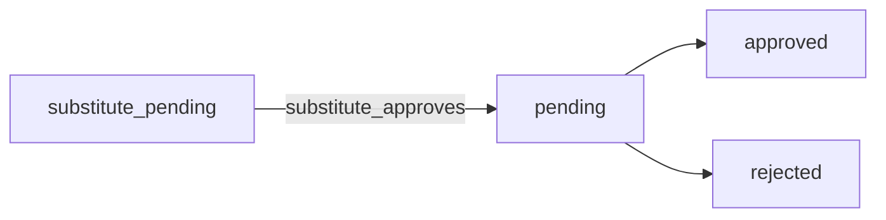

# ArbeitszeitCheck – User Manual

This guide explains how to use **ArbeitszeitCheck** in Nextcloud: what the main screens do, how roles differ, and how common workflows (time tracking, absences, approvals, compliance) work. For technical ArbZG implementation details, see [Compliance-Implementation.en.md](Compliance-Implementation.en.md). For GDPR operation and retention, see [GDPR-Compliance-Guide.en.md](GDPR-Compliance-Guide.en.md).

---

## Legal notice

ArbeitszeitCheck supports technical controls for German working time law (ArbZG) and record-keeping. It is **not** a substitute for legal advice. Your employer remains responsible for policies, configuration, and how data is used. When in doubt, consult your legal counsel or works council.

---

## How to use this manual

- **Employees** can read from [What is ArbeitszeitCheck?](#what-is-arbeitszeitcheck) onward, skip the heavy admin parts, and use [Troubleshooting and common questions](#troubleshooting-and-common-questions) when something looks wrong.
- **Managers** should read [Teams, managers, and who can approve](#teams-managers-and-who-can-approve), [Manager dashboard](#manager-dashboard), and [Reports](#reports).
- **Nextcloud administrators** should read [Initial setup](#initial-setup-and-first-use), the whole [Administration](#administration-nextcloud-administrators) and [Global settings reference](#global-settings-reference-administrators) sections, and keep [Numbers and limits](#numbers-and-limits-quick-reference) handy.

The manual uses **simple words first**, then precise terms (status codes, config keys) where it helps avoid mistakes.

---

## Table of contents

1. [What is ArbeitszeitCheck?](#what-is-arbeitszeitcheck)
2. [Initial setup and first use](#initial-setup-and-first-use)
3. [Teams, managers, and who can approve](#teams-managers-and-who-can-approve)
4. [Roles and what you see](#roles-and-what-you-see)
5. [Opening the app and navigation](#opening-the-app-and-navigation)
6. [Dashboard](#dashboard)
7. [Time entries](#time-entries)
8. [Absences and leave](#absences-and-leave)
9. [Reports](#reports)
10. [Working time compliance](#working-time-compliance)
11. [Calendar and timeline](#calendar-and-timeline)
12. [Settings](#settings)
13. [Manager dashboard](#manager-dashboard)
14. [Substitution requests (Vertretung)](#substitution-requests-vertretung)
15. [Administration (Nextcloud administrators)](#administration-nextcloud-administrators)
16. [Global settings reference (administrators)](#global-settings-reference-administrators)
17. [Exports, DATEV, and data export](#exports-datev-and-data-export)
18. [Notifications and background jobs](#notifications-and-background-jobs)
19. [Optional ProjectCheck integration](#optional-projectcheck-integration)
20. [Troubleshooting and common questions](#troubleshooting-and-common-questions)
21. [Numbers and limits (quick reference)](#numbers-and-limits-quick-reference)
22. [Glossary](#glossary)

---

## What is ArbeitszeitCheck?

ArbeitszeitCheck is a **self-hosted** time tracking app inside your Nextcloud. It is designed around **German labor law (ArbZG)** concepts such as daily limits, mandatory breaks, rest periods between shifts, and documentation of night/Sunday/holiday work. Data stays on your server.

Typical capabilities:

- Clock in and out, start and end breaks, and view your current session.
- Create and edit **time entries** (manual entries where allowed).
- Request **absences** (vacation, sick leave, and other types) with approval workflows.
- View **compliance** information and violations for your recorded times.
- See **calendar** and **timeline** views of work and absences.
- **Managers** approve absences and **time entry corrections** for their team; **administrators** configure models, holidays, teams, and global rules.

---

## Big ideas in simple words

| Idea | Plain explanation |
|------|-------------------|
| **You** | Whoever is logged into Nextcloud. The app always records data **per user account**. |
| **Time entry** | One continuous work period: a **start** and an **end** (and **breaks** inside, depending on how your entry is stored). It is the basic “brick” of all reports. |
| **Clock in / clock out** | Live buttons that **start** or **stop** the current work period without typing times by hand. While you are clocked in, the app counts your **current session**. |
| **Break** | Time when you are **not working** during a shift. You **start** and **end** a break like separate steps so the system can check break rules. |
| **Working time model** | A **rule package** (hours per day, breaks, limits) your **administrator** assigns to you. It drives what “normal” and “too much” means in checks. |
| **Absence** | A request covering one or more **days** off (vacation, sick leave, …). It can need **approvals** and may reduce your **vacation balance**. |
| **Colleague** | Someone the app considers **in your team** for substitutes and some checks—see [Teams](#teams-managers-and-who-can-approve). |
| **Compliance** | Automatic **comparison** of your recorded times against rules (breaks, rest between days, max hours, …). A **violation** is a flagged issue; it is a **system message**, not a court decision. |
| **Correction** | A **formal change request** for an old time entry: you propose new times and a **reason**; a **manager** (or the system in edge cases) must agree. |

---

## Initial setup and first use

### Server and app (administrators)

1. **Install and enable** the app on your Nextcloud instance (`occ app:enable arbeitszeitcheck` or via the Apps UI). The app runs database migrations on upgrade; ensure upgrades complete successfully.
2. **Decide team mode** before you onboard users at scale (see [Teams, managers, and who can approve](#teams-managers-and-who-can-approve)): either **shared Nextcloud groups** (default) or **ArbeitszeitCheck app teams** with explicit members and managers.
3. Open **Administration** in ArbeitszeitCheck (or **Nextcloud administration → ArbeitszeitCheck**) and configure **[Global settings](#global-settings-reference-administrators)** (federal state for holidays, compliance toggles, carryover rules, notifications).
4. Define **working time models** and assign them under **Administration → Users** (work schedule, vacation days, validity dates, opening balances where used).
5. Maintain **holidays**: statutory holidays depend on the configured **federal state** (`german_state`); company-specific days are edited under **Holidays and calendars**.
6. Optional: import vacation opening balances via `occ arbeitszeitcheck:import-vacation-balance` (see release or developer docs).

Until teams/groups and models are set up, employees may see **empty colleague lists** (no substitute), **no manager** for approvals, or **auto-approved** requests in edge cases—see the next section.

### First login (employees)

- If you have **no time entries** yet, the **dashboard** shows a **welcome** card with short steps: clock in/out, breaks, manual entries, and **Absences**.
- The app can store **onboarding completed** per user (API: `/api/settings/onboarding-completed`); whether a guided tour appears depends on your UI version.
- Configure **personal** preferences in **My settings** inside the app and/or **Nextcloud → Personal settings → ArbeitszeitCheck** (vacation days per year, hours per day, notification toggles—your organization may standardize one place).

---

## Teams, managers, and who can approve

ArbeitszeitCheck decides **who is in your team**, **who counts as a colleague** (e.g. for substitutes), and **who may approve** absences and time-entry corrections using one global switch:

| Mode | App config `use_app_teams` | Where it is changed |
|------|----------------------------|----------------------|
| **Nextcloud groups (legacy)** | `0` (default) | **Administration → Teams and locations**: toggle **off** (“Use ArbeitszeitCheck teams for approvals”) |
| **App teams** | `1` | Same page: toggle **on** |

### Mode A: Nextcloud groups (default, `use_app_teams = 0`)

- **Team members** for a user are **all other Nextcloud users who share at least one group** with that user (`getTeamMemberIds` / group iteration).
- **Colleagues** (substitute list, and “has someone in the same team”) are the **same set**: other users in any shared group (`getColleagueIds`).
- There are **no named “managers” in the database**. Anyone who shares a group with you is a **peer colleague**; **approval rights** use “can this user manage this employee?” which in practice means **same-group membership** for the approver (plus Nextcloud admins). So in small setups, **many people in one big group** can all approve each other’s items if the permission logic treats them as managers—**your organization should structure groups** (e.g. one group per team with a dedicated approver account, or use app teams below).
- **Manager dashboard / Reports sidebar**: appear when `getTeamMemberIds` is non-empty **or** the user is a Nextcloud admin—i.e. you must **share a group with at least one other user** to get “manager” UI as a non-admin.

### Mode B: App teams (`use_app_teams = 1`)

- Administrators define a **hierarchy** under **Administration → Teams and locations** (“Add unit”, tree structure).
- Each unit has **Members** and **Managers** tabs.
- **Managers** see as direct reports: members of teams they manage, **including descendant teams** in the tree (`getIdsWithDescendants`).
- **Colleagues** for substitutes: users who are members of teams where you are a **member or a manager** (so pure managers still see members as colleagues).
- **Explicit manager lists** per employee exist: `getManagerIdsForEmployee` returns managers assigned to teams the employee belongs to. Some features (e.g. **email managers when substitute approves**) are documented in global settings as requiring app teams.

### Auto-approval when nobody is available to approve

Behavior differs slightly between **absences** and **time entry corrections** (as implemented in services):

| Situation | Absence (`pending` only, no substitute flow) | Time entry correction |
|-----------|-----------------------------------------------|------------------------|
| Rule | Auto-approves if the employee is considered to have **no manager context**: first, if app teams are on, **no assigned managers** for the employee’s teams; **and** if that yields no managers, the legacy check: **no colleagues** (`getColleagueIds` empty). | Auto-approves if **`getColleagueIds` is empty** (no colleague in the configured team model)—**does not** use the explicit app-team manager list the same way as absences. |
| Typical result | If you are **alone** in your groups **or** not placed in teams with others, requests may **auto-approve** to avoid being stuck. | Same idea for corrections: **isolated users** get auto-approved corrections. |

**Operational takeaway:** For real approval workflows, ensure every employee has **colleagues and/or assigned managers** as intended—otherwise auto-approval can occur. Use **app teams** when you need clear **manager** assignments and reporting lines.

### Substitute list empty?

- **Colleagues** are computed from the active mode above. If the list is empty, users cannot pick a substitute; fix **group membership** or **app team membership**.

---

## Roles and what you see

| Role | Typical meaning in the app |
|------|----------------------------|
| **Employee** | Any logged-in user. Records own time and absences; sees own compliance; uses exports for **own** data. |
| **Manager** | A user who **has at least one team member** in the app’s team model (Nextcloud groups and/or app-managed teams, depending on configuration). Can open the **Manager** dashboard and approve requests for those team members. |
| **Nextcloud administrator** | Member of the Nextcloud admin group. Can open **Administration** in the sidebar (global settings, users, working time models, holidays, teams, audit log). Also treated as having manager-level access where the app grants admins broad access (e.g. reports). |
| **Substitute** | A colleague selected on an absence request. When a request awaits **substitute approval**, the substitute can approve or decline on the **Substitution requests** page (link appears when you have pending items). |

**Important:** The sidebar **Reports** entry is shown only to users who may access **manager-level reporting** (users with team members **or** administrators). Plain employees without team management do not see **Reports**; if they open the reports URL directly, they are redirected to the dashboard.

---

## Opening the app and navigation

1. Sign in to Nextcloud.
2. Open the app menu and choose **ArbeitszeitCheck** (or the name your organization uses).

The left sidebar usually includes:

| Item | Purpose |
|------|---------|
| **Dashboard** | Home: status, clock, today’s hours, recent entries. |
| **Time entries** | List, create, edit, and correct entries. |
| **Absences** | Request and manage leave/absences. |
| **Reports** | Only for managers/admins: team/organization reports. |
| **Working time compliance** | Compliance overview and violations. |
| **Calendar** | Calendar view of work and absences. |
| **Timeline** | Chronological list of work periods. |
| **My settings** | Personal preferences and GDPR data export link. |
| **Administration** | Nextcloud admins only: sub-pages for overview, users, working time models, holidays, teams, audit log, global settings. |
| **Manager** | If you have team members (or are admin): approvals and team overview. |
| **Substitution requests** | If you have pending substitute approvals: approve/reject coverage for colleagues. |

---

## Dashboard

The **Dashboard** is the home screen after you open the app. Think of it as your **control panel for today**.

### What you see (in plain terms)

- **Status badge**: tells you whether you are **working right now** (clocked in), **on a break**, or **not working** (clocked out).
- **Timer**: while you are clocked in or on break, you usually see **how long** the current session or break has been running.
- **Buttons**: only the actions that make sense **right now** are offered (you cannot “end break” if you are not on a break).
- **Today’s figures**: quick view of **hours today** (wording depends on your language pack).
- **Recent entries**: a short list of **latest time entries** so you can spot mistakes early.
- **Vacation / stats cards** (if shown): may show **remaining vacation**, **carryover**, or similar—your admin decides what is maintained.

### Typical day (step by step)

1. **Start work** → press **Clock in** (or the equivalent in your language). The status should show **clocked in**.
2. **Need a break** → **Start break** before you leave the desk; when you return, **End break**. The app needs these steps to measure breaks correctly.
3. **End work** → **Clock out**. Your work period is stored as a **time entry** you can find under **Time entries**.
4. If you forgot to clock: add or fix times under **Time entries** (within the **14-day** edit window) or request a **correction** for older days.

### First visit

If you have **never** created a time entry, you may see a **welcome** box with short hints. That is only to help you start; your real data still lives under **Time entries**.

---

## Time entries

The **Time entries** area is your **full list** of work periods: everything the app knows about **when** you worked, **how long**, and **which breaks** belong to each period.

### List and opening a record

- You get a **table or list** of entries, usually **newest first** or by date—your screen may offer **filters** (date range, status).
- Click an entry to see **details**: start, end, breaks, type, notes, and **compliance** messages if any.
- From here you can **edit** (if allowed), **delete** (if allowed), or **request correction** (if the entry is too old to edit directly).

### Creating a new entry (manual)

1. Open **Time entries** → use **Create** / **Add** (exact label depends on language).
2. Enter **start** and **end** date/time (and break details if your form asks for them).
3. **Save**. The app checks **overlaps** with other entries and **compliance** rules before accepting.

### Creating and editing entries (rules)

- You can add **manual** time ranges where your organization allows it.
- **Edit window**: you may **change** entries directly only if they are **not older than 14 days** (`EDIT_WINDOW_DAYS` in the app code). Think of it as “you can still fix last week yourself; older changes need a **correction request**.”
- **Overlaps**: two entries for the **same person** cannot cover the **same minute** twice. The app **refuses** overlapping ranges so totals stay correct.
- **Deleting**: some screens show a **deletion impact** warning if removing an entry would affect overtime or compliance—read it before confirming.

### Clock vs manual entries

- **Clock** (Dashboard buttons): the app **creates and updates** one “live” entry while you work. You do not type start/end for the current shift unless you fix it later.
- **Manual** entries: you **type** the whole interval. Use them when you **forgot** to clock, or when your company allows **planned** bookings (still subject to the same checks).

### Overtime and balances (if shown)

The app may show **overtime** or **balance** information based on your **working time model** and recorded hours. Exact formulas are defined by your configuration; if a number looks wrong, check **entries first**, then ask your **administrator**.

### Correction workflow (after the edit window)

If you cannot edit an entry directly (e.g. it is too old), you may **request a correction**:

1. You submit a correction with a **justification** (required).
2. The entry moves to **`pending_approval`** until someone who may manage you (**manager** in app teams, same-group approver in group mode, or Nextcloud admin) approves or rejects.
3. If you have **no colleagues** in the configured team/group model (`getColleagueIds` empty), the correction may be **auto-approved** immediately so it does not stay stuck (see [Teams, managers, and who can approve](#teams-managers-and-who-can-approve)).
4. On **approval**, the proposed changes apply; on **rejection**, the original entry is restored.

Managers handle corrections from the **Manager** dashboard (pending time entry corrections).

### Optional: ProjectCheck

If the **ProjectCheck** app is installed and enabled, time entry forms may let you **link a project** from ProjectCheck. That is optional and depends on your instance.

---

## Absences and leave

### Absence types

The app supports several types, including (internal identifiers in parentheses):

- Vacation (`vacation`)
- Sick leave (`sick_leave`)
- Personal leave (`personal_leave`)
- Parental leave (`parental_leave`)
- Special leave (`special_leave`)
- Unpaid leave (`unpaid_leave`)
- Home office (`home_office`)
- Business trip (`business_trip`)

Exact labels depend on your language pack and UI.

### How to request an absence (step by step)

1. Open **Absences** in the sidebar.
2. Choose **Create** / **New request** (exact label depends on language).
3. Select the **type** (vacation, sick leave, …).
4. Set **start** and **end** dates (and **reason** or **substitute** if the form asks).
5. **Submit**. The app calculates **working days** and may require a **substitute** for certain types.
6. Track **status** in the list: `substitute_pending` → `pending` → `approved` or `rejected`, or shorter paths if no substitute is involved.

### Vacation balances

Vacation entitlement, **carryover** from the previous year, and expiry rules are configured by your **administrator** (and optionally imported via server tools). The dashboard and absence views may show **remaining** days and **carryover** information; details depend on your organization’s setup.

### Substitute requirement

For some absence types, your administrator may **require a substitute** (a colleague who covers your work). You must pick a substitute from the **colleague** list (same team/group). You cannot name yourself.

### Auto-approval of simple absence requests

If an absence is created in status **`pending`** (no substitute) and the employee has **no approver context** (no app-team managers for their units **and** no colleagues in the team model), the system **auto-approves** the absence so it is not left pending forever. Organizations should **avoid** relying on this by ensuring proper teams/groups.

### Sick leave dates

Sick-leave start dates may be restricted to a limited window in the **past** (the app uses **`SICK_LEAVE_MAX_PAST_DAYS`**, currently **7** in `Constants.php`). Dates too far in the past may be rejected.

### Status workflow

Absence records use statuses such as:

| Status | Meaning (short) |
|--------|------------------|
| `pending` | Awaiting **manager** approval (no substitute step, or substitute already agreed). |
| `substitute_pending` | Awaiting the **designated substitute** to approve or decline. |
| `substitute_declined` | Substitute declined; you can update the request (e.g. new substitute) and resubmit. |
| `approved` | Approved. |
| `rejected` | Rejected by manager. |
| `cancelled` | Cancelled (record kept for audit). |

Typical flow **with** a substitute:

If there is **no** substitute, the request usually starts as `pending` and goes to manager approval directly.

### Cancel and shorten

Depending on status, you may **cancel** an absence or **shorten** an approved period (rules are enforced in the app). Cancelled requests remain in the system for traceability.

### Colleagues and teams

The substitute dropdown lists **colleagues** from your team (Nextcloud group or app team, depending on configuration). If the list is empty, contact your administrator.

---

## Reports

The **Reports** page is available only to **managers** and **administrators** (see [Roles](#roles-and-what-you-see)). **Employees** without team responsibility **do not** see this menu; the page **redirects** them if they try the URL.

### What “reports” are

Reports are **read-only summaries** built from **time entries** and **absences**. They help leads and HR see **totals**, **trends**, and **team** comparisons—without changing underlying data from this screen.

### Report types (API / typical UI)

| Type | Plain purpose |
|------|----------------|
| **Daily** | Hours and details for **one day** (you or someone you may view). |
| **Weekly** | **Week** rollup—good for team meetings. |
| **Monthly** | **Month** rollup—payroll prep or reviews. |
| **Overtime** | Focus on **extra** hours vs model—definitions depend on configuration. |
| **Absence** | **Leave** statistics and lists for a period. |
| **Team** | Compare or list **several people** you manage (scope follows permissions). |

**Managers** choose **themselves** or **named team members**. **Administrators** may get **organization-wide** options where the UI offers them (e.g. “all users”). You **never** see people outside your allowed scope.

---

## Working time compliance

**Compliance** means: “did this recorded time **follow the rules** we configured?” The app **does not** replace a lawyer; it **flags** situations that might need review.

### The three compliance screens

| Screen | URL path (after `/apps/arbeitszeitcheck`) | What it is for |
|--------|------------------------------------------|----------------|
| **Overview** | `/compliance` | Summary, score, or status—**your** issues, or **team** issues if you manage people. |
| **Violations list** | `/compliance/violations` | A **list** of issues with filters; open one line to see details. |
| **Compliance reports** | `/compliance/reports` | Broader **report-style** view where your role allows (self vs team vs org for admins—depends on implementation). |

### Violations in plain words

Each **violation** usually has a **type** (e.g. break too short, rest period too short), a **date**, and sometimes a **severity**. **Resolving** marks the item as **handled in the process** (it does not rewrite your time entries automatically unless you edit them separately).

### Who sees what

- **Employees**: their **own** violations (and their own compliance score if shown).
- **Managers**: **team members** they are allowed to manage, plus resolving where permitted.
- **Administrators**: **widest** view, depending on the page.

For **how** checks are calculated (real-time vs background jobs), see [Compliance-Implementation.en.md](Compliance-Implementation.en.md).

---

## Calendar and timeline

These screens help you **see patterns**; they are not the main place to **fix** data.

### Calendar (`/calendar`)

- Shows **work entries** and **approved (or planned) absences** in a **month/week** grid, depending on the UI.
- Useful to spot **missing days**, **overlaps** with leave, or **odd hours** at a glance.
- **Editing** still happens via **Time entries** or the **Dashboard** clock.

### Timeline (`/timeline`)

- Shows your time entries as a **vertical timeline**—good for “what happened **in order** today or this week?”
- Same rule: use **Time entries** to **change** data.

---

## Settings

You may have **two places** with similar toggles: **inside the app** and under **Nextcloud personal settings**. If both exist, pick **one** place as your company standard so you do not fight duplicate values.

### In-app settings (`/settings`)

Typical groups (exact labels depend on language):

- **Working time preferences**: e.g. **automatic break calculation**—when on, the system helps compute required breaks under the configured rules.
- **Notifications**: e.g. **remind to clock out**, **remind to take breaks**—these work together with **Nextcloud notifications** (bell icon) and server jobs.
- **Compliance information**: short **ArbZG** reminders (information only).
- **Working time model** (read-only text): shows that your **model** is assigned by **administration**—contact admin to change it.
- **Data export**: **Export my data** downloads a **JSON** file with your ArbeitszeitCheck-related personal data (**GDPR portability**).

### Nextcloud personal settings

Often includes:

- **Vacation days per year** and **normal working hours per day** (defaults may apply until an admin assigns a model).
- **Notification** checkboxes similar to the in-app page.

If something is **greyed out** or missing, your admin may manage it centrally.

---

## Manager dashboard

Open **Manager** from the sidebar if you see it (you have **team members** in the app’s sense, or you are an **administrator**).

### What you do here (simple checklist)

1. **Pending absences**: open each request, read dates and type, **approve** or **reject** (optional comment—depends on UI).
2. **Pending time corrections**: read the employee’s **reason** and the **proposed** new times, then **approve** or **reject**. Approval **applies** the new times; rejection **keeps** the old entry.
3. **Team views**: use **overview**, **hours**, **compliance**, or **absence calendar** widgets as your version provides—these pull from the same underlying data as **Reports**.

### Important limits

- You **cannot** use manager actions to approve **your own** absence as employee (workflow is for **other** people’s requests).
- You only see users your **role** allows (see [Teams](#teams-managers-and-who-can-approve)).

---

## Substitution requests (Vertretung)

If a colleague names you as **substitute**, and the request is in `substitute_pending`, you will see **Substitution requests** in the sidebar (when there is at least one pending item).

- **Approve** to confirm you will cover the work; the request then moves to **manager approval** (`pending`) unless your organization’s rules differ.
- **Decline** to set status to `substitute_declined`; the requester can change the substitute and resubmit.

Email notifications may be enabled by your administrator.

---

## Administration (Nextcloud administrators)

The **Administration** section is only visible to **Nextcloud administrators**. The same **global settings** form is also available under **Nextcloud administration → Administration → ArbeitszeitCheck** (single consistent configuration).

| Section | Purpose |
|---------|---------|
| **Overview** | High-level stats and pointers into the app. |
| **Users** | **Manage employees**: search users, assign **working time models**, vacation days, validity ranges, opening balances (Resturlaub) per calendar year where your process uses them. |
| **Working time models** | Create/edit **models** (target hours, rules) later assigned to users. |
| **Holidays and calendars** | Statutory holidays (per state), company-specific days, calendar tooling. |
| **Teams and locations** | Toggle **Use ArbeitszeitCheck teams for approvals** and maintain the **organizational tree**, **members**, and **managers** when app teams mode is on. |
| **Audit log** | Inspect recorded actions for audit support. |
| **Global settings** | All **instance-wide** toggles and numeric limits (see next section). |

**Vacation balance import** may use `occ arbeitszeitcheck:import-vacation-balance` (see server or developer documentation).

### What each admin page is for (simple)

| Page | You use it to… |
|------|----------------|
| **Overview** | See **instance-level** hints and jump into other admin areas. |
| **Users** | Find every **Nextcloud user**, attach a **working time model**, set **vacation** figures and **valid from / to** dates, and maintain **opening balances** (Resturlaub) per year when your process uses them. |
| **Working time models** | Create **templates** (“40h office”, “shift model”, …) with **rules**; then assign those templates on the **Users** page. |
| **Holidays and calendars** | Maintain **public** holidays (often seeded from **federal state**) and **company-only** days; review calendar-related options together with **global settings**. |
| **Teams and locations** | Turn **app teams** on or off and edit the **org tree**, **members**, and **managers**—this is the **heart** of who may approve whom in app-team mode. |
| **Audit log** | Search or browse **who changed what** for audits and disputes. |
| **Global settings** | Tune **compliance**, **notifications**, **carryover**, **exports**, **emails**, **retention**, and **defaults** for the whole instance. |

---

## Global settings reference (administrators)

These settings apply to **all users** unless noted. Labels match the in-app **Global settings** / Nextcloud admin form.

### Compliance and working time rules

- **Check working time rules automatically** (`auto_compliance_check`): batch/daily style checks.
- **Real-time compliance check when recording** (`realtime_compliance_check`): validate on save/edit of entries.
- **Strict mode** (`compliance_strict_mode`): if on, violations can **block** saving; if off, violations are shown but saving may still be allowed.
- **Send alerts when rules are broken** (`enable_violation_notifications`): notify relevant users/managers.

### Exports and reporting

- **Split overnight entries at midnight in CSV/JSON export** (`export_midnight_split_enabled`): splits cross-midnight bookings into two dated rows for export layout only; **DATEV export stays unsplit**.

### Absences, email, calendar

- **Vacation carryover expiry** (month/day, `vacation_carryover_expiry_month` / `vacation_carryover_expiry_day`): last calendar date to use **carryover** from opening balance; after that, new vacation draws from annual entitlement only (see form help in UI for FIFO ordering).
- **Send iCal for approved absences** and options to copy **substitute** / **team managers** (`send_ical_*`, `send_ical_to_managers`).
- **Sync approved absences / public holidays to Nextcloud Calendar** (`calendar_sync_absences_enabled`, `calendar_sync_holidays_enabled`).
- **Email notifications for substitution workflow** (`send_email_substitution_request`, `send_email_substitute_approved_to_employee`, `send_email_substitute_approved_to_manager`—manager mail is tied to app teams as in the UI).
- **Substitute required** per absence type (`require_substitute_types` JSON array).

### Daily hours, rest, region, retention

- **Maximum working hours per day** (`max_daily_hours`, default 10).
- **Minimum rest between work days** (`min_rest_period`, default 11 hours).
- **Standard working hours per day** (`default_working_hours`, default 8)—fallback for new users until models apply.
- **Default federal state for holidays** (`german_state`, e.g. `NW`)—used when no more specific state is set.
- **Auto-restore statutory holidays** (`statutory_auto_reseed`) when viewing calendars.
- **Data retention period in years** (`retention_period`) for automated deletion horizons (align with legal advice).

---

## Exports, DATEV, and data export

### What exports are for

**Exports** are **files** you download to **store**, **email**, or **import** into payroll tools. They are **snapshots**: they show what was in the database **at export time** for the **date range** you picked.

### Download exports (time entries, absences, compliance)

- You (or your admin flow) choose a **start** and **end** date.
- The app **refuses** ranges longer than **365 days** per file—if you need more, export **January–June** and **July–December** separately, for example.
- **CSV** and **JSON** are common; **PDF** may **not** be implemented for some export types—the UI will say so.
- **Overnight shifts**: for CSV/JSON, admins can enable **split at midnight** (two rows for one long shift) for readability; **DATEV** stays **unsplit**—see [Global settings](#global-settings-reference-administrators).

### DATEV

**DATEV** is a **German payroll/accounting** interchange format. Your **finance or HR** team tells you which **columns** they need and how to upload the file. ArbeitszeitCheck generates a file that fits that workflow when your instance enables it.

### GDPR JSON export

Under **Settings → Data export**, **Export my data** downloads a **JSON** bundle of your ArbeitszeitCheck-related personal data. This supports GDPR **data portability** (take your data to another system).

**Deletion** of personal data may be limited by **legal retention**; see [GDPR-Compliance-Guide.en.md](GDPR-Compliance-Guide.en.md). A technical `POST /gdpr/delete` endpoint exists for eligible flows—your IT policy decides who may use it.

---

## Notifications and background jobs

The app registers background jobs such as:

- **Daily compliance check**
- **Clock-out reminder**
- **Missing time entry reminder**
- **Break reminder**

Whether you receive **notifications** depends on Nextcloud notification settings and app configuration. In-app settings (and personal settings) may include toggles for reminders (e.g. clock-out, breaks).

---

## Optional ProjectCheck integration

If the **ProjectCheck** app is installed (optional dependency), ArbeitszeitCheck can **link time entries to ProjectCheck projects** and optionally sync data for reporting. If ProjectCheck is not installed, project fields are simply hidden or unused.

---

## Troubleshooting and common questions

### Clock and entries

- **I pressed Clock in but nothing changed**  
  Refresh the page; check your **network**; if it persists, ask an admin to verify the app and **background jobs** are running.

- **I cannot clock in—an error mentions rest period**  
  The system may block a new shift if your **last shift** ended too recently. Fix the **previous day’s** end time (if wrong) via **Time entries** or a **correction**, or wait until the **minimum rest** has passed—see your admin’s **min rest hours** setting.

- **My break is wrong**  
  Check that you used **Start break** / **End break** in order. Edit within **14 days** on **Time entries**, or request a **correction**.

### Colleagues, substitutes, managers

- **Colleague list is empty**  
  You are not in a **shared group** (group mode) or **app team** (app-team mode) with anyone else. Ask an admin to add you to the right **group** or **team**.

- **I am a manager but I see no Manager menu**  
  In group mode you need **at least one other user** in your group. In app-team mode you must be listed as a **manager** of a team with **members**. Nextcloud **admins** always have broad access.

- **My request was approved instantly**  
  See [Auto-approval](#auto-approval-when-nobody-is-available-to-approve). Usually means **no colleagues / no managers** were configured—fix **teams**, not the button.

### Absences and vacation

- **Vacation balance looks wrong**  
  Check **approved** vs **pending** requests; **carryover** expiry date in **global settings**; and your **working time model** assignment on the **Users** admin page.

- **Sick leave date rejected**  
  Start date may be too far in the past—see [Sick leave dates](#sick-leave-dates).

### Compliance and exports

- **Too many violations**  
  Read each message; often **break** or **rest** issues. **Strict mode** may block saves—admin setting. For technical detail see [Compliance-Implementation.en.md](Compliance-Implementation.en.md).

- **Export says range too long**  
  Shorten the range to **≤ 365 days** or split into **multiple exports**.

### Privacy and accounts

- **I left the company**  
  Account removal is a **Nextcloud admin** topic. ArbeitszeitCheck data may be subject to **retention**; see the GDPR guide.

---

## Numbers and limits (quick reference)

Values come from `lib/Constants.php` and admin defaults unless your administrator changed them.

| Topic | Limit | Notes |
|-------|--------|--------|
| Edit time entries yourself | **14 days** | `EDIT_WINDOW_DAYS`; older → **correction** workflow |
| Export date range | **365 days** max per export | `MAX_EXPORT_DATE_RANGE_DAYS` |
| Sick leave start in the past | **7 days** max (app default) | `SICK_LEAVE_MAX_PAST_DAYS` |
| Single absence request length | **365 days** max | `MAX_ABSENCE_DAYS` |
| Default vacation days / year | **25** | `DEFAULT_VACATION_DAYS_PER_YEAR` until user/model overrides |
| List pages (API default page size) | **25** rows typical | `DEFAULT_LIST_LIMIT`; max **500** `MAX_LIST_LIMIT` |

---

## Glossary

| Term | Meaning |
|------|---------|
| **Administration** | Nextcloud **admin** area of the app: users, models, holidays, teams, global settings. |
| **App teams** | Teams stored **inside** ArbeitszeitCheck (not the same as Nextcloud Groups). Used when **Use ArbeitszeitCheck teams** is on. |
| **ArbZG** | German Working Time Act (Arbeitszeitgesetz). |
| **Clock in / out** | Start or end a recorded work session from the **Dashboard**. |
| **Colleague** | Another user your app considers in your **team** for substitutes and some checks. |
| **Compliance** | Automatic checking of recorded times vs **configured** rules. |
| **Correction** | Formal **change request** for an entry you cannot edit anymore. |
| **DATEV** | German payroll/accounting **file format** used by many accountants. |
| **Manager (in the app)** | Someone who may **approve** absences/corrections for **team members**—not always the same as your HR title. |
| **Nextcloud group** | Standard Nextcloud **user group**; used for team membership when **app teams** are off. |
| **Rest period** | Minimum **uninterrupted** time off work between two working days (often **11 hours**; see **min rest** in settings). |
| **Substitution / substitute** | A colleague who **covers** your work during absence; may need to **approve** first. |
| **Time entry** | One recorded **work period** (start/end, breaks). |
| **Violation** | A **flag** from compliance checks—not a legal verdict. |
| **Working time model** | Pack of **rules** (hours, breaks) assigned by an administrator. |

---

*Document version: aligned with ArbeitszeitCheck app constants and routes in the main development branch. For changes to limits (e.g. edit window, export range), see `lib/Constants.php`.*
