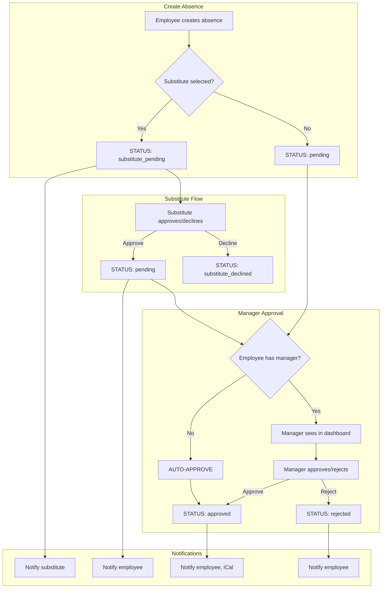
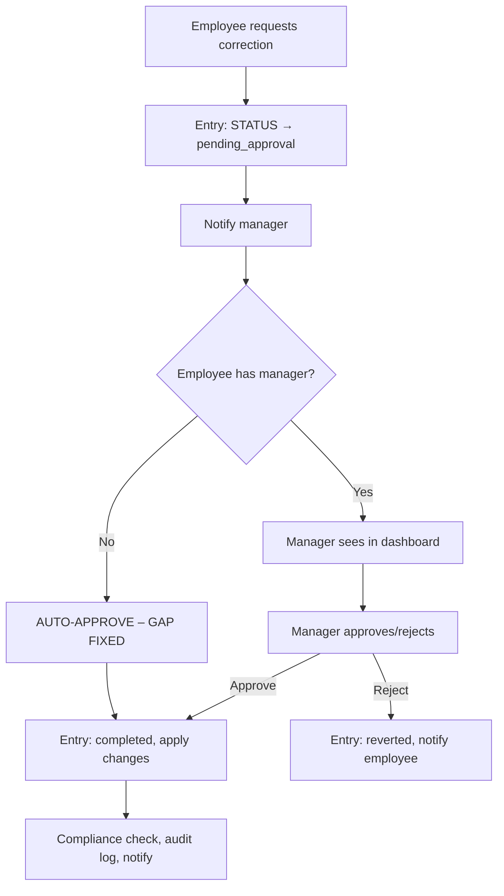

# ArbeitszeitCheck – Workflows and Edge Cases

## 1. Absence Workflow



### Edge Cases Handled

| Scenario | Handling |
|----------|----------|
| **Employee has no colleagues** | Auto-approve on create (or after substitute approves) |
| **Solo user (admin only)** | Auto-approve |
| **Substitute declines** | Status → substitute_declined; employee can edit and resubmit with different substitute |
| **Manager dashboard empty for admin** | Admin with no team members sees empty list; no stuck absences (auto-approved) |

### Logic: `employeeHasManager(userId)`

- `true` when `getColleagueIds(userId)` is non-empty (at least one colleague in same team/groups)
- `false` when employee is alone in their groups or has no groups
- Used in `createAbsence` and `approveBySubstitute` to trigger auto-approve

---

## 2. Time Entry Correction Workflow



### Edge Case: No Manager (FIXED)

**Problem:** If employee has no colleagues, their time entry correction would stay in `pending_approval` forever (same pattern as absences).

**Fix:** In `TimeEntryController::requestCorrection`, after the correction is saved and notified, check `employeeHasManager(userId)`. If false, call `autoApproveTimeEntryCorrection()`: set status to completed, run compliance check, audit log `time_entry_correction_auto_approved`, notify employee.

---

## 3. Manager Dashboard Visibility

```mermaid
flowchart TD
    A[Manager/Admin opens dashboard] --> B[getTeamMemberIds(managerId)]
    B --> C{teamUserIds empty?}
    C -->|Yes| D[Empty pending list]
    C -->|No| E[findPendingForUsers(teamUserIds)]
    E --> F[findPendingApprovalForUsers for time entries]
    D --> G[Admin with no team: sees nothing]
    G --> H[OK: No stuck items – auto-approved]
```

**Note:** Admins have `canManageEmployee(admin, X) = true` for any X, but pending approvals are filtered by `getTeamMemberIds(managerId)`. For admins with no team, the list is empty. Auto-approve for users without managers ensures no items remain stuck.

---

## 4. Permission Summary

| Action | Permission | Notes |
|--------|------------|-------|
| Create absence | Owner | Validated: substitute must be colleague |
| Approve absence | `canManageEmployee(approver, employee)` | Admin or shared group |
| Substitute approve/decline | `absence.substitute_user_id === currentUser` | Only designated substitute |
| Request time correction | Owner | Entry must be completed, not already pending |
| Approve time correction | `canManageEmployee(approver, entry.userId)` | Admin or shared group |
| Resolve compliance violation | `canResolveViolation(actor, owner)` | Admin or manager |
| Access manager dashboard | `canAccessManagerDashboard(userId)` | Admin OR has team members |

---

## 5. Audit Trail

| Action | Audit action | performedBy |
|--------|--------------|-------------|
| Absence created | `absence_created` | userId |
| Absence auto-approved | `absence_auto_approved` | `system` |
| Absence approved | `absence_approved` | approverId |
| Substitute approved | `absence_substitute_approved` | substituteUserId |
| Time correction requested | `time_entry_correction_requested` | userId |
| Time correction approved | `time_entry_correction_approved` | managerId or `system` |
| Time correction auto-approved | `time_entry_correction_auto_approved` | `system` |

---

## 6. Remaining Considerations

1. **Compliance violations:** Admin can resolve any; manager only for team. If employee has no manager, only admin can resolve. No auto-resolve (would be unsafe).
2. **Update absence:** Owner can update when status is pending/substitute_pending. Adding/removing substitute can change flow; validation ensures substitute is colleague.
3. **Delete absence:** Owner can delete when pending/substitute_pending only.
4. **WCAG 2.1 AA:** Sections use headings, `aria-live` regions, `role="alert"` for errors, focus management.
